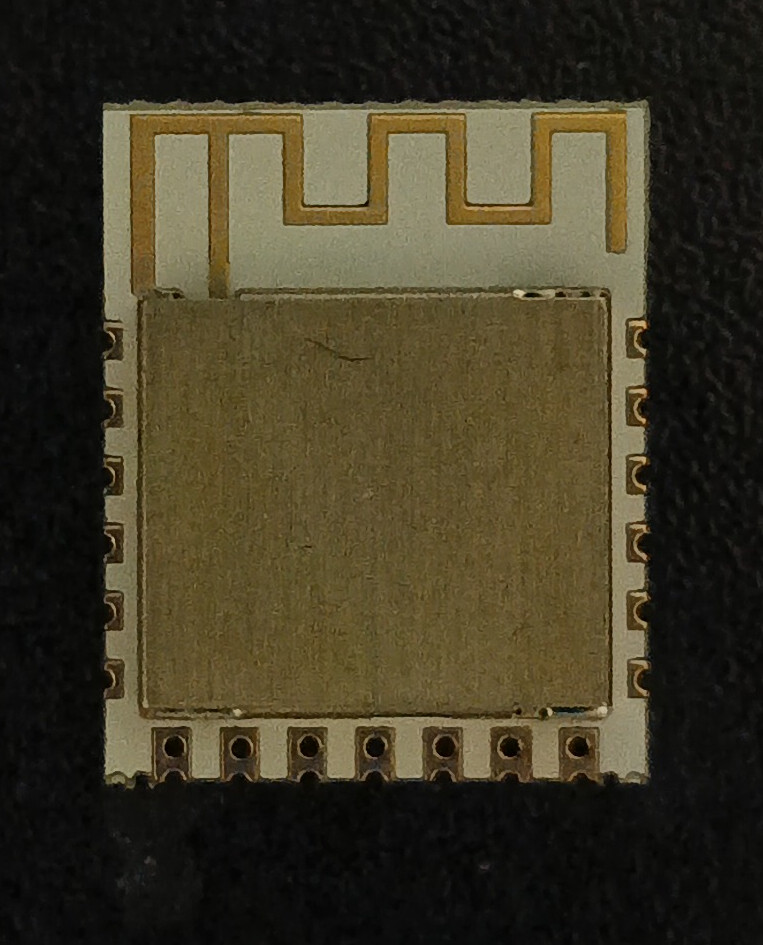
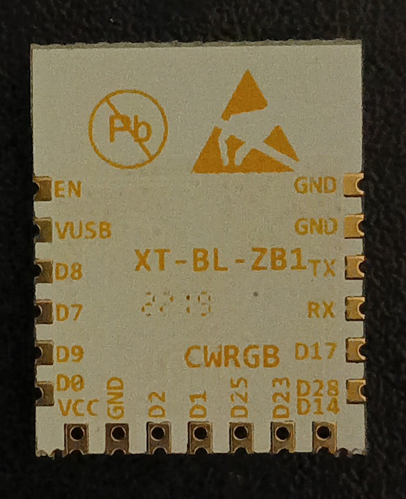
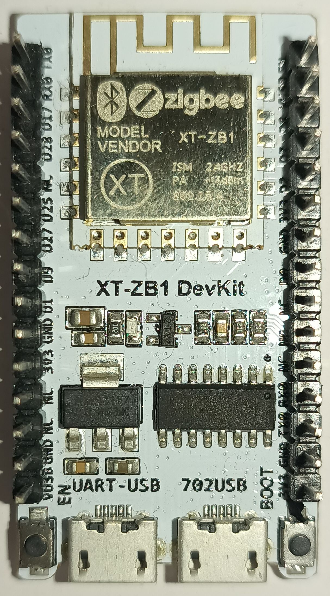

.. _xt_bl_zb1:

BL702 Module
#######################

Overview
********

BL702 is a low-power, high-performance IoT chip that supports BLE/Zigbee wireless networking,
built-in single-core RISC-V 32-bit CPU, supports multiple security mechanisms.
The chip provides rich cache and memory resources, integrates a variety of peripherals,
and provides an industry-leading single-chip multi-purpose solution for IoT products, w
hich is suitable for a wide range of IoT application scenarios.

Hardware
********

For more information about the Bouffalo Lab BL-602 MCU:

- `Bouffalo Lab BL702 MCU Website`_
- `Bouffalo Lab BL702 MCU Datasheet`_
- `Bouffalo Lab Development Zone`_

Supported Features
==================

The board configuration supports the following hardware features:

+-----------+------------+-----------------------+
| Interface | Controller | Driver/Component      |
+===========+============+=======================+
| MTIMER    | on-chip    | RISC-V Machine Timer  |
+-----------+------------+-----------------------+
| PINCTRL   | on-chip    | pin muxing            |
+-----------+------------+-----------------------+
| UART      | on-chip    | serial port-polling   |
+-----------+------------+-----------------------+

The default configurations can be found in the Kconfig
:zephyr_file:`boards/riscv/xt_bl_zb1/xt_bl_zb1_defconfig`.

System Clock
============

The BL702 Development Board is configured to run at max speed (144MHz).

Serial Port
===========

The xt_bl_zb1_ uses UART0 as default serial port.  It is connected to a
USB Serial converter and is used for both programming and UART.

Programming and Debugging
*************************

Debugging
=========

#. Jtag defaults for BL702 are as follow:
GPIO0 TMS
GPIO1 TDI
GPIO2 TCK
GPIO9 TDO

#. BEWARE

The markings on some BL702 devkits are wrong, the JTAG pins are swapped.
The following for my board:
'D1' : GPIO2
'D2' : GPIO9
'D9' : GPIO1

This board's UART DID NOT WORK via the built-in CH340 with default settings, use a external UART to
USB in this case.

Samples
=======

#. Build the Zephyr kernel and the :ref:`hello_world` sample application:

   .. zephyr-app-commands::
      :zephyr-app: samples/hello_world
      :board: xt_bl_zb1
      :goals: build
      :compact:

#. To flash an image:

   #. Pull up GPIO28

   #. Pull down EN for a short time (or reset power)

   #. Leave GPIO28 floating again

   .. code-block:: console

      west flash

#. Run your favorite terminal program to listen for output. Under Linux the
   terminal should be :code:`/dev/ttyUSB0`. For example:

   .. code-block:: console

      $ screen /dev/ttyUSB0 115200

.. _Bouffalo Lab BL702 MCU Website:
	https://en.bouffalolab.com/product/?type=detail&id=8

.. _Bouffalo Lab BL602 MCU Datasheet:
	https://github.com/bouffalolab/bl_docs/tree/main/BL702_DS/

.. _Bouffalo Lab Development Zone:
	https://dev.bouffalolab.com/home?id=guest

